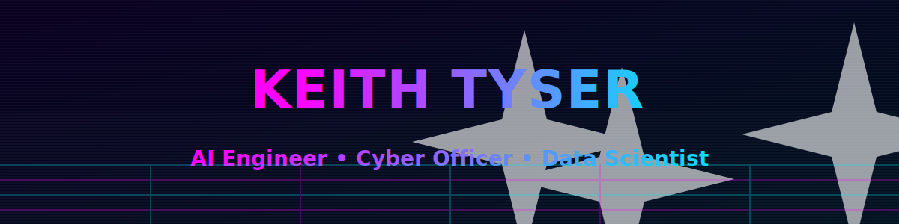

<picture>
  <source media="(prefers-color-scheme: dark)" srcset="keith-tyser-banner.svg">
  
</picture>

# 👋 Hi, I'm Keith Tyser  
🎖️ Army Cyber Officer | 🧠 AI/ML Engineer | 🧩 Data Scientist  

---

---

### 🚀 What I'm Building Now
- 🧠 Training my own **NanoChat** model ([karpathy/nanochat](https://github.com/karpathy/nanochat))  
- 🤖 Building **AI Agents**
---

  
<b>🧰 Tech Stack</b>
 

---

### 🌎 Let's Connect

---

### ⭐ Featured Projects
- 🧩 **[LoRA-Provenance](https://github.com/keithtyser/lora-provenance)** — tracing and analyzing model lineage in fine-tuned LLMs  
- 🏀 **[Hoops-Elo](https://github.com/keithtyser/hoops-elo)** — basketball performance modeling and Elo rating simulation engine  

---

### 📊 GitHub Stats

---